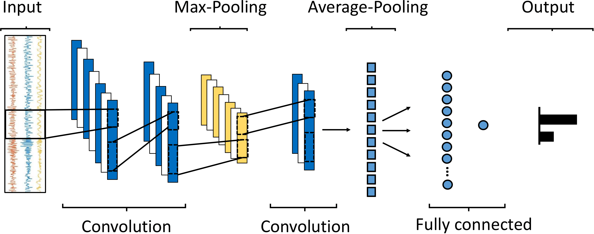

# Real-Time-Edge-FoG-recognition
End-to-end one-dimensional convolutional neural network optimized for real-time freezing of gait detection running on resource-limited devices 

## Train and Evaluate Script

The script "train_and_evaluate.py" trains and tests a one dimensional convolutional neural network (1D-CNN) developed for FoG detection. 
The model is schematically represented in the figure below.

The 1D-CNN consists of a first convolutional block with two consecutive convolutional layers, with 20 and 16 filters, kernel size of 5 and 7, and dilated convolutions (dilation rate = 2). This is followed by a max-pooling layer with pool size of 2. The third convolutional layer has 12 filters, kernel size of 9 and dilated convolutions. An average-pooling layer is fully-connected to a dense layer with 16 neurons, followed by the single output neuron. Leaky rectified linear unit (Leaky-ReLU) activation function was used in all layers except for the output, where a sigmoid activation function determines the class probability. An l2 regularization of 0.001 were used in all layers to prevent over-fitting.

The input has size 64 timesteps × 4 channels, where 64 correponds to the windows size (2-second window, sampling frequency = 32 Hz) and 4 is the number of components of the 3-axis accelerometer plus the magnitude vector (forth column). 

### Input

The script takes two CSV files as input:

- `train_data.csv` for training data
- `test_data.csv` for testing data

These files should contain a table with N samples and 4 columns. The 4 columns contain angular velocity data (`accX`, `accY`, `accZ`, measured in g-force), the magnitude vector, and the FoG label (`fogLabel`). 
The number of samples depends on the amount of data, that should be sampled or resampled at 32 Hz.

#### Example Data Format

Here's an example of the expected format for the CSV files:

| accX         | accY         | accZ         | mag         | fogLabel |
|--------------|--------------|--------------|-------------|----------|
| -0.973987593 | -0.021478966 | -0.10645139  | 0.980022998 | 0        |
| -0.974905024 | -0.020255725 | -0.10645139  | 0.980908762 | 0        |
| -0.974905024 | -0.020969282 | -0.105533959 | 0.980824619 | 0        |
| -0.973274036 | -0.020561535 | -0.104922338 | 0.979129114 | 1        |
| -0.974905024 | -0.021173156 | -0.104616527 | 0.980730711 | 1        |
| -0.975516645 | -0.022600271 | -0.103699096 | 0.981273152 | 0        |

### Output

The script outputs the test label and prediction, writing to two CSV files:

- `test_label.csv`
- `test_prediction.csv`

The test label is extracted from the `test_data.csv` file. The prediction is obtained from the trained model and is in the form of probability (from 0 to 1). 
Test label and prediction can then be used for computing classification metrics. 
When evaluating test performance, remember that test data and label are here segmented with a 50% overlap (1s slide).

### Important Information

1. Make sure your data is sampled or resampled to 32 Hz.
2. Adjust the learning rate, number of epochs, and batch size based on your dataset size. Specifically, as your dataset size increases, reduce the learning rate and increase the number of epochs and batch size. This model configuration was trained, validated and tested on 15 hours of data from 62 subjects.
3. While the window size should be fixed at 2 seconds, you can adjust the overlap as you prefer. As the overlap increases, more windows are generated, producing more training data, which is beneficial. However, too large overlap may lead to overfitting. Thus, find the best compromise.
4. This model has shown good performance on accelerometer data recorded from the lower back. Evaluations on data recorded from other body locations produce different results.

## Citation

Please cite the following paper in your publications if this repository helps your research.

Borzì L, Sigcha L, Firouzi F, Olmo G, Demrozi F, Bacchin RA, et al. Edge-based freezing of gait recognition in Parkinson's disease. Computers and Electrical Engineering. 2025. doi:article-submitted
